# tibs-ota

## Design
This system design for STM32 uses a wifi module(esp32) to wirelessly download firmware updates. When the STM32 powers up, it checks if it has to enter normal execution or bootloader mode based on any predefined conditions. If OTA mode is selected, the STM32 enters the bootloader, initializes communication with the esp, and waits for firmware data.

The wifi module connects to a network, contacts our server, and checks for an update. If a new firmware version exists, it downloads the file and streams it to the STM32. The STM32 receives the firmware, stores it in flash, or a part of its memory, and verifies it via CRC. If valid, it erases the previous firmware and writes the new one. Once it is done, it boots with the updated application. If CRC verification fails, it reports an error or cancels the update.

